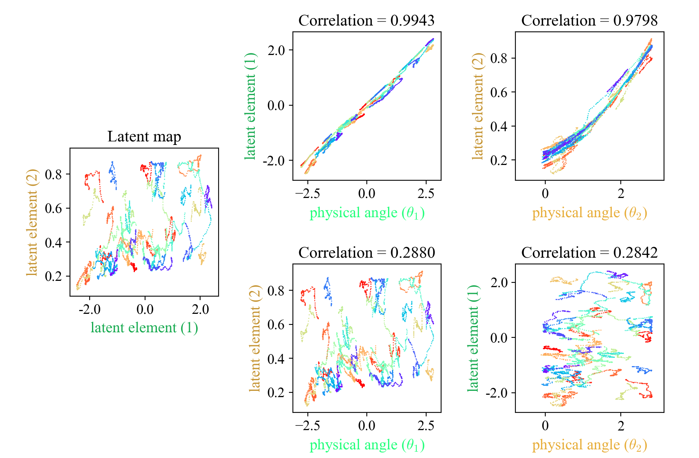
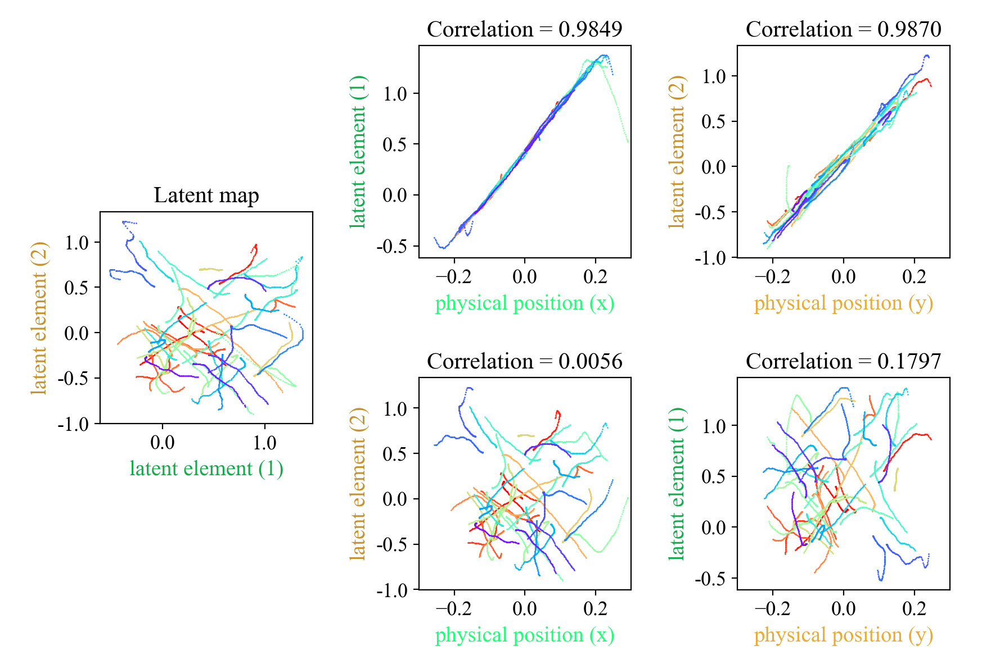

# NewtonianVAE

[](LICENSE.md)

This is NOT an official implementation.

Point Mass and Reacher2D show high correlation between latent space and physical location.
But I'm still working on fixing some details. Destructive changes may be made (2022/12/14).

Paper

- Original: https://arxiv.org/abs/2006.01959

Other References (All implementations are PyTorch)

- TS-NVAE
  - paper: https://arxiv.org/abs/2203.05955
- VRNN
  - paper: https://arxiv.org/abs/1506.02216
  - impl: https://github.com/emited/VariationalRecurrentNeuralNetwork
- World Models
  - paper: https://arxiv.org/abs/1803.10122
  - impl: https://github.com/ctallec/world-models
- PlaNet (RSSM):
  - paper: https://arxiv.org/abs/1811.04551
  - impl: https://github.com/Kaixhin/PlaNet
- Spatial Broadcast Decoder
  - paper: https://arxiv.org/abs/1901.07017
  - impl: https://github.com/dfdazac/vaesbd

## Prerequisites

Install the necessary packages.

```bash
pip install -r requirements.txt
```

And install PyTorch manually by referring to the [official site](https://pytorch.org/).

### Tips

The installation of matplotlib, opencv, and their associated Qt is likely to be environmentally dependent.

## Run

These should be run under the [exec](exec) directory.

### Create Data

Example:

```bash
python create_data.py --config config/reacher2d.json5
```

If you want to see what kind of data you are looking for:

```bash
python create_data.py --config config/reacher2d.json5 --watch plt
```

### Train

Example:

```bash
python train.py --config config/reacher2d.json5
```

### Correlation

Example:

```bash
python correlation.py --config config/reacher2d.json5 --env-domain reacher2d
```



```bash
python correlation.py --config config/point_mass.json5 --env-domain point_mass
```



In a point_mass environment, they may become negatively correlated or the correlated axes may be inverted.

### Control with PID

You can give the target image in the source code and see how it behaves.

Example:

```bash
python control_pure.py --config config/reacher2d.json5 --episodes 3 --format gif --save-anim
```


## Acknowledgements

[@ItoMasaki](https://github.com/ItoMasaki) helped me understand the detailed formulas.
